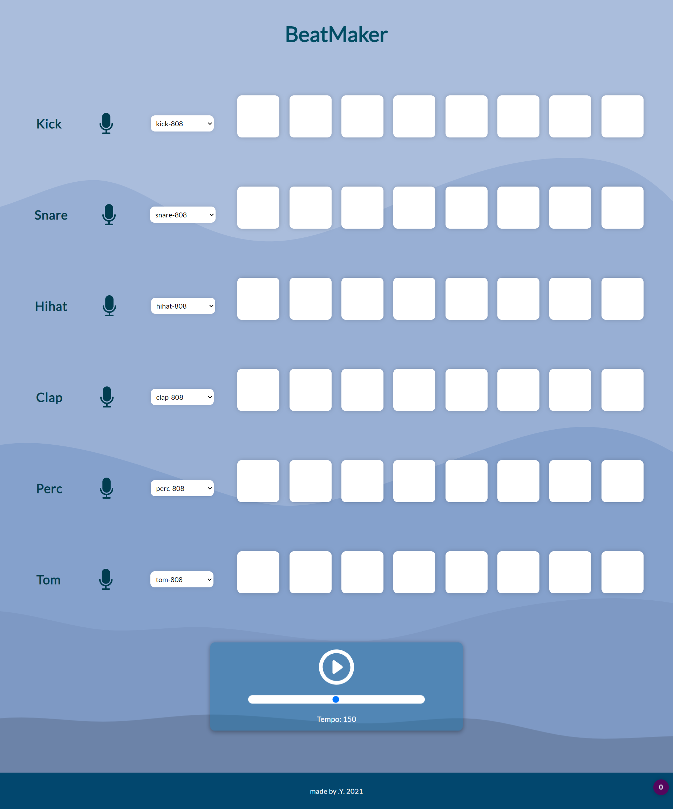

# Project BeatMaker

We can pick different beats and create some music (or just some noise).
Anyway, nothing difficult, just click on any beats in a grid, choose the sound and play.
We can also change the tempo and have fun.

## Techologies:

- HTML
- CSS
- Javascript

### A little glimpse of it:

